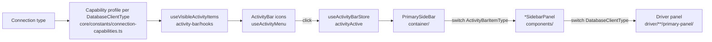

# Primary Sidebar Flow

How a click on the activity bar ends up rendering an engine-specific panel from
`components/modules/driver/`.

## 1. Overview



Two switches decide what is rendered:

1. `PrimarySideBar` picks **one wrapper per activity** (`ActivityBarItemType`).
2. Each wrapper picks **one panel per database type** (`DatabaseClientType`).

## 2. Layers

| Layer                | File                                                      | Responsibility                                                                                                                                  |
| -------------------- | --------------------------------------------------------- | ----------------------------------------------------------------------------------------------------------------------------------------------- |
| Activity ids         | `core/types/entities/activity-bar.entity.ts`              | `ActivityBarItemType` enum (re-exported by the store; safe to import from server code)                                                          |
| Activity state       | `core/stores/useActivityBarStore.ts`                      | Persisted `activityActive`, `ensureActivityVisible()`                                                                                           |
| Capability config    | `core/constants/connection-capabilities.ts`               | **Single source of truth.** One profile per `DatabaseClientType`: `family`, `visibleActivityItems`, `defaultActivityItem`, `supportsQueryFiles` |
| Activity item config | `core/constants/activityBarVisibility.ts`                 | Presentation only: `BASE_ACTIVITY_ITEMS` with `id`, `title`, `icon`                                                                             |
| Visible activities   | `app-shell/activity-bar/hooks/useVisibleActivityItems.ts` | Profile + `visibleActivityItems` for the selected connection, shared by the two consumers below                                                 |
| Activity bar UI      | `app-shell/activity-bar/hooks/useActivityMenu.ts`         | Builds the icon list; `onChangeActivity()` calls `setActivityActive()`                                                                          |
| Sidebar container    | `app-shell/primary-side-bar/container/PrimarySideBar.vue` | Switch on `activityActive`, passes `dbType`, falls back to a visible activity when the connection changes                                       |
| Activity wrappers    | `app-shell/primary-side-bar/components/*SidebarPanel.vue` | Switch on `dbType`, return the driver panel or `null`                                                                                           |
| Driver panels        | `driver/<engine>/primary-panel/<activity>/`               | The actual panel UI and its hooks                                                                                                               |
| Shared header        | `driver/shared/primary-panel/shared/`                     | `PrimaryPanelHeader` used by every panel                                                                                                        |

`PrimarySideBar` is mounted once in `layouts/default.vue` and only renders while
the sidebar is open (`appConfigStore.layoutSize[0]`).

## 3. Visible activities per connection

Read straight from `CONNECTION_CAPABILITY_REGISTRY`, which is keyed by every
`DatabaseClientType` (a new type without a profile fails the typecheck). SQL
types share `SQL_PROFILE` / `SQL_BASIC_PROFILE` and override only what differs.
With no connection selected, or an unknown type, the PostgreSQL profile applies.
This matrix is locked by `test/unit/core/constants/connection-capabilities.spec.ts`.

| Activity       | PostgreSQL | MySQL / MariaDB | SQLite | Oracle | MSSQL / Snowflake | Redis | MongoDB |
| -------------- | :--------: | :-------------: | :----: | :----: | :---------------: | :---: | :-----: |
| Explorer       |     ✓      |        ✓        |   ✓    |   ✓    |         ✓         |   ✓   |    –    |
| Schemas        |     ✓      |        ✓        |   ✓    |   ✓    |         ✓         |   ✓   |    ✓    |
| ERD            |     ✓      |        ✓        |   ✓    |   ✓    |         ✓         |   –   |    –    |
| Users & Roles  |     ✓      |        –        |   –    |  ✓ ¹   |        ✓ ¹        |   –   |    –    |
| Database Tools |     ✓      |        ✓        |   ✓    |   ✓    |         ✓         |   ✓   |    ✓    |
| AI Agent       |     ✓      |        –        |   –    |   –    |         ✓         |   –   |    –    |

¹ Oracle, MSSQL and Snowflake list `UsersRoles`, so they currently get the
PostgreSQL users panel.

When the selected connection changes, `PrimarySideBar` calls
`ensureActivityVisible()` so a hidden activity falls back to the type's
`defaultActivityItem` (`Schemas` for every type today).

## 4. Panel per activity and database type

| Wrapper                     | SQL family ³                | Redis                     | MongoDB                   |
| --------------------------- | --------------------------- | ------------------------- | ------------------------- |
| `ExplorerSidebarPanel`      | `ExplorerPanel`             | `ExplorerPanel`           | `null`                    |
| `SchemasSidebarPanel`       | `SqlSchemasPanel`           | `RedisSchemasPanel`       | `MongoSchemasPanel`       |
| `ErdDiagramSidebarPanel`    | `ErdDiagramPanel`           | `null`                    | `null`                    |
| `UsersRolesSidebarPanel`    | `PgUsersAndPermissionPanel` | `null`                    | `null`                    |
| `DatabaseToolsSidebarPanel` | `SqlDatabaseToolsPanel`     | `RedisDatabaseToolsPanel` | `MongoDatabaseToolsPanel` |
| `AgentSidebarPanel`         | `AgentPanel`                | `AgentPanel`              | `null`                    |

³ Every SQL type (`postgres`, `mysql`, `mysql2`, `mariadb`, `sqlite3`,
`better-sqlite3`, `mssql`, `oracledb`, `snowflake`) is listed as its own `case`
and shares the `default` branch, so unknown types still get the SQL panel.

## 5. Where panels live

```
components/modules/driver/
├── shared/
│   ├── primary-panel/
│   │   ├── explorer/        ExplorerPanel
│   │   ├── schemas/         SqlSchemasPanel
│   │   ├── agent/           AgentPanel
│   │   └── shared/          PrimaryPanelHeader
│   └── sql/primary-panel/
│       ├── erd-diagram/     ErdDiagramPanel
│       └── database-tools/  SqlDatabaseToolsPanel
├── postgres/primary-panel/
│   └── users-roles/         PgUsersAndPermissionPanel
├── redis/primary-panel/
│   ├── schemas/             RedisSchemasPanel
│   └── database-tools/      RedisDatabaseToolsPanel
└── mongodb/primary-panel/
    ├── schemas/             MongoSchemasPanel
    └── database-tools/      MongoDatabaseToolsPanel
```

Naming: `<Engine><Activity>Panel` for engine-specific panels, `Sql…Panel` for
panels shared by the SQL family, plain `<Activity>Panel` for panels shared across
families.

## 6. Recipes

### Give one database type its own panel

Example: a MySQL-specific schemas panel.

1. Create `driver/mysql/primary-panel/schemas/MysqlSchemasPanel.vue` (plus
   `index.ts`). Start with `PrimaryPanelHeader`.
2. In `SchemasSidebarPanel.vue`, move `case DatabaseClientType.MYSQL:` (and
   `MYSQL2` if it applies) out of the SQL group and return `MysqlSchemasPanel`.
3. Import it from `#components`. Nuxt registers components by file name
   (`pathPrefix: false`), so the file name must be unique across `components/`.

### Show an existing activity for another database type

Example: MongoDB Database Tools.

1. Add the activity to that type's `visibleActivityItems` in
   `CONNECTION_CAPABILITY_REGISTRY` (`core/constants/connection-capabilities.ts`).
2. Make sure the wrapper returns a panel for that type instead of `null`.
3. Update the matrix in `connection-capabilities.spec.ts`.

### Add a new activity

1. Add the value to `ActivityBarItemType` in
   `core/types/entities/activity-bar.entity.ts`.
2. Add an entry to `BASE_ACTIVITY_ITEMS` with `id`, `title`, `icon` (icon must
   exist in `node_modules/@iconify-json/hugeicons/icons.json`).
3. Add it to the `visibleActivityItems` of each type that should show it, and
   update the matrix in `connection-capabilities.spec.ts`.
4. Create `app-shell/primary-side-bar/components/<Activity>SidebarPanel.vue`
   with a `switch (props.dbType)` and export it from `components/index.ts`.
5. Add a `case` for it in `PrimarySideBar.vue`.
6. Create the panels under `driver/**/primary-panel/<activity>/`.

## 7. Rules

- `PrimarySideBar` and the `*SidebarPanel` wrappers only switch; business logic
  belongs in the driver panel and its hooks.
- Every level wraps its `<component :is>` in `<KeepAlive>`, so each panel keeps
  its tree/scroll state when switching activities or connection types.
- Panels import the header from
  `~/components/modules/driver/shared/primary-panel/shared`.
- Persisted UI state (expanded nodes, scroll position) goes in
  `useActivityBarStore`, not in the panel.
- A driver folder must not import another driver folder; move shared code to
  `driver/shared/`.
