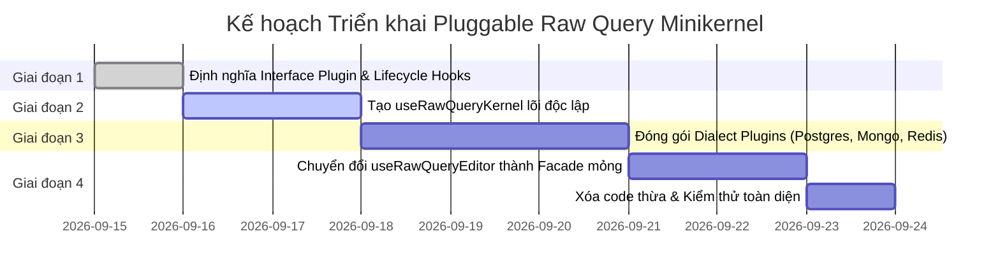

# Raw Query Minikernel & Pluggable Architecture Report

> **Tài liệu phân tích & Kiến trúc đề xuất:** Tách lõi `useRawQueryKernel` và hệ thống Pluginable Dialect Registry.  
> **Ngày lập:** 15/09/2026  
> **Khu vực khảo sát:** `components/modules/raw-query/hooks/*` & `registry/*`  
> **Mục tiêu:** Tách triệt để logic core của Raw Query thành Minikernel độc lập, đẩy toàn bộ logic custom của các database (PostgreSQL, MongoDB, Redis, MySQL, SQLite) vào Registry/Plugins thông qua vòng đời Lifecycle Hooks chuẩn hóa (`preloadSchema`, `loadSchema`, `resolveStatement`, `execute`,...).

---

## 1. Tổng quan & Động lực tái cấu trúc

### 1.1 Hiện trạng kiến trúc hiện tại

Hiện tại, Raw Query sử dụng facade hook [`useRawQueryEditor.ts`](file:///Volumes/Cinny/Cinny/Project/orca-q-projects/OrcaQ/components/modules/raw-query/hooks/useRawQueryEditor.ts) làm trung tâm điều phối. Tuy nhiên, qua quá trình phát triển hỗ trợ nhiều cơ sở dữ liệu (Postgres, MySQL, Redis, MongoDB), facade này và các hook phụ thuộc đã phát sinh hiện tượng **rò rỉ logic chuyên biệt (Dialect Leaks)** vào các tầng core:

- **MongoDB:** Bị hardcode rẽ nhánh trong [`useRawQueryEditor.ts`](file:///Volumes/Cinny/Cinny/Project/orca-q-projects/OrcaQ/components/modules/raw-query/hooks/useRawQueryEditor.ts) với hơn 8 điểm kiểm tra `if (isMongoConnection.value)` (execute, format, cancel, state, extensions).
- **Redis:** Bị nhúng trực tiếp vào [`useQueryExecution.ts`](file:///Volumes/Cinny/Cinny/Project/orca-q-projects/OrcaQ/components/modules/raw-query/hooks/useQueryExecution.ts) (`useRedisWorkspaceStore`, `parseRedisDatabaseIndex`, endpoint riêng `/api/redis/workbench/execute`, `normalizeRedisResult`) và [`useSqlEditorExtensions.ts`](file:///Volumes/Cinny/Cinny/Project/orca-q-projects/OrcaQ/components/modules/raw-query/hooks/useSqlEditorExtensions.ts) (`redis()` extension).
- **PostgreSQL:** Logic `EXPLAIN ANALYZE` (`useRawQueryExplainAnalyzeOptions.ts`) và keyword completion chuyên biệt (`pgKeywordCompletion`) bị mặc định xem như tính năng cốt lõi.

```mermaid
graph TD
    subgraph Hiện Tại [Monolithic Facade - Bị Coupling]
        Editor[useRawQueryEditor] --> SQL[useSqlEditorExtensions]
        Editor --> Exec[useQueryExecution]
        Editor --> MongoExt[useMongoScriptEditorExtensions]
        Editor --> MongoExec[useMongoScriptExecution]
        Editor --> Explain[useRawQueryExplainAnalyzeOptions]

        SQL -.->|Hardcode check| RedisExt[redis\(\)]
        Exec -.->|Hardcode check| RedisAPI[/api/redis/workbench/execute]
        Exec -.->|Hardcode check| SqliteCheck[SQLite Variable check]
    end

    subgraph Mục Tiêu [Pluggable Minikernel Pattern]
        Kernel[useRawQueryKernel]
        Registry[Dialect Registry & Profile]

        Kernel -->|Loads active dialect| Registry
        Registry --> PGPlugin[PostgreSQL Plugin]
        Registry --> MongoPlugin[MongoDB Plugin]
        Registry --> RedisPlugin[Redis Plugin]
        Registry --> MySQLPlugin[MySQL Plugin]
    end
```

### 1.2 Mục tiêu của `useRawQueryKernel`

1. **Lõi siêu nhỏ (Minikernel):** Chỉ quản lý EditorView lifecycle, ResultTabs, Compartment switching, Context distribution, Execution state machine chung (`IDLE -> PREPARING -> EXECUTING -> STREAMING -> DONE / ERROR`).
2. **Pluginable / Registry-driven:** Mọi hành vi đặc thù (cú pháp, format, gợi ý schema, thực thi, hủy lệnh, error diagnostics, context menu, toolbar actions) đều do **Dialect Plugin** cung cấp.
3. **Chuẩn hóa Lifecycle Events:** Hỗ trợ các hook như `onInit`, `preloadSchema`, `loadSchema`, `resolveStatement`, `beforeExecute`, `execute`, `format`, `onDestroy`.

---

## 2. Báo cáo kiểm toán chi tiết: Toàn bộ `hooks/*`

Dưới đây là bảng phân loại và đánh giá mức độ coupling của 12 hooks trong thư mục `components/modules/raw-query/hooks/`:

| Tên Hook                                  | Phân Loại                   | Nhiệm Vụ Hiện Tại                                     | Mức Độ Dính Logic Custom & Điểm Cần Tách                                                                                                                                             |
| :---------------------------------------- | :-------------------------- | :---------------------------------------------------- | :----------------------------------------------------------------------------------------------------------------------------------------------------------------------------------- |
| **`useRawQueryEditor.ts`**                | ⚠️ **Coupled Facade**       | Ghép nối execution, extensions, tabs, editor view.    | 🔴 **Cao (Critical):** Rẽ nhánh trực tiếp cho Mongo và SQL; tự khởi tạo Explain Options của Postgres; quản lý compartment thủ công. Cần chuyển thành `useRawQueryKernel`.            |
| **`useQueryExecution.ts`**                | ⚠️ **Coupled Core**         | Quản lý vòng đời chạy câu lệnh và streaming.          | 🔴 **Cao:** Bị dính toàn bộ Redis REST execution, SQLite variable exception, Postgres Explain prefix & endpoint `/api/query/raw-execute`. Cần tách logic thực thi ra dialect driver. |
| **`useSqlEditorExtensions.ts`**           | ⚠️ **Coupled Custom**       | Khởi tạo CodeMirror extensions cho SQL.               | 🔴 **Cao:** Mặc dù tên là SQL nhưng lại chứa cả cấu hình `redis()`, hover docs của SQL, kiểm tra Postgres dialect. Cần chuyển thành `SqlDialectPlugin`.                              |
| **`useRawQueryExplainAnalyzeOptions.ts`** | ❌ **Pure Custom**          | Sinh chuỗi `EXPLAIN (ANALYZE, ...)`                   | 🔴 **Cao:** Hoàn toàn thuộc về PostgreSQL. Cần chuyển vào `pg/` hoặc `postgres.profile.ts`.                                                                                          |
| **`useStreamingQuery.ts`**                | 🟢 **Core Transport**       | Đọc stream NDJSON từ `/api/query/raw-execute-stream`. | 🟢 **Thấp (Clean):** Thuần túy network transport; có thể giữ làm shared utility cho các relational dialect plugins.                                                                  |
| **`useResultTabs.ts`**                    | 🟢 **Pure Core**            | Quản lý danh sách Map tabs, activeTabId, đóng mở tab. | 🟢 **Không có (Zero coupling):** Hoàn toàn sạch sẽ, là thành phần cốt lõi của `useRawQueryKernel`.                                                                                   |
| **`useRawQueryFileContent.ts`**           | 🟢 **Core Workspace**       | Đọc/ghi nội dung file, đồng bộ route, connection ID.  | 🟢 **Không có:** Thuần quản lý file persistence và workspace connection state.                                                                                                       |
| **`useRawQueryContext.ts`**               | 🟡 **Core DI**              | Quản lý và cung cấp `RawQueryContext`.                | 🟡 **Thấp:** Cần loại bỏ các field cứng của Postgres (`explainAnalyzeOptionItems`, `serializeMode`) và để chúng nằm trọn vẹn trong generic `dialectState`.                           |
| **`useRawQueryEditorContextMenu.ts`**     | 🟡 **Coupled UI**           | Cung cấp menu chuột phải trong editor.                | 🟡 **Trung bình:** Hardcode kiểm tra `getCurrentStatement` (SQL AST) và cờ `isExplainSupported`. Cần chuyển sang cơ chế cho phép Dialect Plugin đóng góp menu items.                 |
| **`useRawQueryMutation.ts`**              | 🔵 **Feature (Result Tab)** | Quản lý cập nhật/xóa dòng trên bảng kết quả.          | 🟡 **Trung bình:** Chỉ áp dụng cho Relational Grid (`ResultTabResultView`). Không thuộc editor kernel.                                                                               |
| **`useRawQueryRelationPreview.ts`**       | 🔵 **Feature (Result Tab)** | Điều hướng xem trước bảng quan hệ (FK/Reverse FK).    | 🟢 **Thấp:** Chỉ thuộc tầng Result Tab, không ảnh hưởng editor core.                                                                                                                 |
| **`useRawQueryEditedCells.ts`**           | 🔵 **Feature (Result Tab)** | Theo dõi các ô bị chỉnh sửa trên AG-Grid.             | 🟢 **Thấp:** Thuộc tầng Grid Data, không dính vào editor core.                                                                                                                       |

---

## 3. Kiến trúc Đề xuất: Minikernel & Plugin Lifecycle

Mô hình kiến trúc mới gồm 3 tầng rõ rệt:

```text
┌──────────────────────────────────────────────────────────────────────────────────┐
│                             RawQuery.vue (Container)                            │
└────────────────────────────────────────┬─────────────────────────────────────────┘
                                         │
                 ┌───────────────────────▼───────────────────────┐
                 │             useRawQueryKernel                 │
                 │  - EditorView Lifecycle & Container Ref       │
                 │  - ResultTabs State Manager                   │
                 │  - Execution State Machine (Loading/Stream)   │
                 │  - Compartment Manager (Extensions Swapper)   │
                 │  - Lifecycle Hook Dispatcher                  │
                 └───────────────────────┬───────────────────────┘
                                         │
                    ┌────────────────────┴────────────────────┐
                    ▼                                         ▼
   ┌─────────────────────────────────┐       ┌─────────────────────────────────┐
   │       RawQueryContext           │       │    RawQueryDialectRegistry      │
   │  - Master Unified Context       │       │  - Database Profile & Drivers   │
   │  - Generic TDialectState        │       │  - Dialect Lifecycle Handlers   │
   └─────────────────────────────────┘       └────────────────┬────────────────┘
                                                              │
                     ┌───────────────────────┬────────────────┴───────────────────────┐
                     ▼                       ▼                                        ▼
           PostgresDialectPlugin     MongoDialectPlugin                       RedisDialectPlugin
           - preloadSchema()         - preloadSchema() (Workers)              - loadSchema() (Keys)
           - resolveStatement()      - resolveStatement() (AST)               - resolveStatement() (Line)
           - execute() (Stream SQL)  - execute() (Worker Sandbox / API)       - execute() (Workbench REST)
           - extensions (SQL + PG)   - extensions (TS + Mongo Autocomplete)   - extensions (Redis Lexer)
```

---

## 4. Đặc tả Vòng đời (Lifecycle Hooks & Events) cho Dialect Plugin

Để Minikernel hoàn toàn không cần biết chi tiết của từng database, mỗi `RawQueryDialectPlugin` (được tích hợp trong `RawQueryProfile`) sẽ implement các hook vòng đời sau:

```typescript
export interface RawQueryDialectPlugin<TDialectState = any> {
  databaseType: DatabaseClientType;

  // ==========================================================================
  // 1. LIFECYCLE: Khởi tạo & Dọn dẹp
  // ==========================================================================
  /**
   * Khởi tạo state riêng cho session truy vấn (VD: pending approvals, badge text, explain options)
   */
  createState?: () => TDialectState;

  /**
   * Chạy khi editor mount hoặc khi connection chuyển sang loại database này
   */
  onInit?: (context: RawQueryContext<TDialectState>) => Promise<void> | void;

  /**
   * Chạy khi unmount hoặc chuyển sang database khác (dọn dẹp timers, worker, cache)
   */
  onDestroy?: (context: RawQueryContext<TDialectState>) => Promise<void> | void;

  // ==========================================================================
  // 2. SCHEMA & METADATA LIFECYCLE: Chuẩn bị & nạp cấu trúc dữ liệu
  // ==========================================================================
  /**
   * Tải trước metadata ở background (VD: warm up worker, fetch collection lists, load schema cache)
   * Giúp editor sẵn sàng autocompletion ngay khi gõ mà không bị block UI.
   */
  preloadSchema?: (context: {
    connection: Connection;
    workspaceId: string;
  }) => Promise<void> | void;

  /**
   * Nạp đầy đủ schema chi tiết (bảng, cột, types, relations) cho gợi ý code & diagnostics
   */
  loadSchema?: (context: {
    connection: Connection;
    workspaceId: string;
    forceRefresh?: boolean;
  }) => Promise<void> | void;

  // ==========================================================================
  // 3. EDITOR & CODEMIRROR EXTENSIONS: Giao diện soạn thảo
  // ==========================================================================
  /**
   * Cung cấp danh sách CodeMirror extensions chuyên biệt cho dialect này
   * (Cú pháp, syntax highlighter, autocompletion source, linter, hover docs)
   */
  getEditorExtensions?: (
    context: RawQueryContext<TDialectState>
  ) => Extension[];

  /**
   * Trích xuất câu lệnh tại vị trí con trỏ (Statement Resolution)
   * - SQL: Parse AST tìm câu lệnh tại cursor kết thúc bởi dấu ;
   * - MongoDB: Parse JS/TS AST hoặc lấy toàn bộ script / selection
   * - Redis: Lấy toàn bộ dòng văn bản hiện tại
   */
  resolveStatement?: (
    editorView: EditorView,
    context: RawQueryContext<TDialectState>
  ) => {
    statementText: string;
    from: number;
    to: number;
    metadata?: Record<string, any>;
  } | null;

  /**
   * Định dạng câu lệnh (Formatting)
   */
  formatCode?: (
    code: string,
    context: RawQueryContext<TDialectState>,
    options?: { statementOnly?: boolean }
  ) => Promise<string> | string;

  // ==========================================================================
  // 4. EXECUTION LIFECYCLE: Vòng đời thực thi câu lệnh
  // ==========================================================================
  /**
   * Kiểm tra và chuẩn bị trước khi thực thi
   * (VD: cảnh báo connection strict-mode, prompt missing variables, write approval challenge)
   * Return false để chặn thực thi.
   */
  beforeExecute?: (params: {
    statement: string;
    context: RawQueryContext<TDialectState>;
  }) => Promise<boolean> | boolean;

  /**
   * Driver thực thi câu lệnh chính
   * Chịu trách nhiệm gọi API phù hợp (NDJSON streaming, REST, Worker) và bắn event về kernel
   */
  execute: (params: {
    statement: string;
    context: RawQueryContext<TDialectState>;
    tabItem: ExecutedResultItem;
    callbacks: {
      onMeta: (meta: {
        fields?: any[];
        command?: string;
        [key: string]: any;
      }) => void;
      onRows: (batch: any[], totalCount: number) => void;
      onDone: (summary: { rowCount: number; queryTime: number }) => void;
      onError: (error: { message: string; data?: any }) => void;
      onLog?: (log: { level: string; args: any[]; timestamp?: number }) => void;
    };
  }) => {
    abort?: () => void;
  };

  /**
   * Hủy thực thi câu lệnh đang chạy
   */
  cancelExecute?: (context: RawQueryContext<TDialectState>) => void;

  // ==========================================================================
  // 5. UI EXTENSIONS: Context Menu & Toolbar Contributions
  // ==========================================================================
  /**
   * Cấu hình Context Menu (chuột phải) riêng của Dialect
   * Cho phép đóng góp items theo section hoặc ghi đè toàn bộ menu
   */
  contextMenu?: RawQueryDialectContextMenuConfig<TDialectState>;
}
```

---

## 5. Thiết kế Chi tiết Hệ thống Pluggable Context Menu

### 5.1 Vấn đề hiện tại của Context Menu

Trong file hiện tại [`useRawQueryEditorContextMenu.ts`](file:///Volumes/Cinny/Cinny/Project/orca-q-projects/OrcaQ/components/modules/raw-query/hooks/useRawQueryEditorContextMenu.ts):

- **Bị trói chặt vào SQL:** Hàm `resolveCurrentStatements()` gọi trực tiếp `getCurrentStatement(view)` - một tiện ích parse SQL AST. Khi mở file MongoDB hay Redis, context menu vẫn cố định vị SQL statement!
- **Hardcode tính năng PostgreSQL:** Cờ `isExplainSupported` được kiểm tra cứng cho `Postgres` để chèn mục `"Analyze Query"`.
- **Thiếu khả năng mở rộng:** MongoDB không thể thêm các hành động đặc thù như `"Explain Query Plan (explain())"`, `"Wrap in .toArray()"`, `"Insert aggregate([]) skeleton"`; Redis không thể có `"Execute Current Line"`, `"Inspect Key TTL"`.

### 5.2 Mô hình Section-based & Slot Contribution

Để Kernel vừa giữ được các thao tác chuẩn (Copy, Cut, Paste, Delete), vừa cho phép Dialect tự do mở rộng, ta phân chia Context Menu thành 5 phân vùng (**Sections**):

```typescript
export enum RawQueryContextMenuSection {
  EXECUTION = 'execution', // Nhóm thực thi: Execute statement/script/line, Run selection
  ANALYSIS = 'analysis', // Nhóm phân tích: Explain, Query Plan, Visualizer, Execution Stats
  FORMAT = 'format', // Nhóm định dạng: Format statement/code, Beautify, Lint Fix
  TOOLS = 'tools', // Nhóm công cụ dialect: Convert syntax, Helper wrapping, Templates
  EDIT = 'edit', // Nhóm thao tác văn bản chuẩn: Copy, Cut, Delete
}
```

Mỗi khi mở Context Menu, Kernel sẽ tổng hợp một đối tượng ngữ cảnh `RawQueryContextMenuContext` truyền cho Plugin:

```typescript
export interface RawQueryContextMenuContext<TDialectState = any> {
  context: RawQueryContext<TDialectState>;
  editorView: EditorView;
  selectedText: string;
  hasSelection: boolean;
  hasContent: boolean;
  hasStatement: boolean;
  statementInfo?: {
    text: string;
    from: number;
    to: number;
    metadata?: Record<string, any>;
  };
}
```

### 5.3 Giao diện Cấu hình Context Menu cho Plugin

```typescript
export interface RawQueryDialectContextMenuConfig<TDialectState = any> {
  /**
   * Đóng góp items vào các sections chuẩn của Kernel
   * Items sẽ tự động được đặt đúng vị trí và ngăn cách bởi separator một cách thanh lịch
   */
  getItems?: (ctx: RawQueryContextMenuContext<TDialectState>) => {
    section: RawQueryContextMenuSection;
    items: ContextMenuItem[];
    order?: number;
  }[];

  /**
   * Builder toàn quyền: Nếu plugin muốn tự sắp xếp thứ tự hoặc override toàn bộ menu
   */
  buildMenu?: (
    ctx: RawQueryContextMenuContext<TDialectState>,
    defaultSections: Record<RawQueryContextMenuSection, ContextMenuItem[]>
  ) => ContextMenuItem[];
}
```

### 5.4 Minh họa Cấu hình Context Menu cho từng Cơ sở dữ liệu

#### 1. PostgreSQL Context Menu (Hỗ trợ Submenu Explain Analyze đa tầng)

```typescript
// postgres.profile.ts
export const postgresContextMenu: RawQueryDialectContextMenuConfig<PostgresDialectState> =
  {
    getItems: ctx => [
      {
        section: RawQueryContextMenuSection.EXECUTION,
        items: [
          {
            type: ContextMenuItemType.ACTION,
            title: 'Execute Statement',
            icon: 'hugeicons:play',
            shortcut: '⌘↵',
            disabled: !ctx.hasStatement,
            select: () => ctx.context.onExecuteCurrent?.(),
          },
        ],
      },
      {
        section: RawQueryContextMenuSection.ANALYSIS,
        items: [
          {
            type: ContextMenuItemType.SUBMENU,
            title: 'Explain & Analyze',
            icon: 'hugeicons:analytics-01',
            disabled: !ctx.hasStatement,
            items: [
              {
                type: ContextMenuItemType.ACTION,
                title: 'Explain (Analyze + Buffers)',
                shortcut: '⌘E',
                select: () => ctx.context.onExplainAnalyzeCurrent?.(),
              },
              {
                type: ContextMenuItemType.ACTION,
                title: 'Explain (Simple Plan)',
                select: () =>
                  ctx.context.rawQueryEditor?.executeWithPrefix('EXPLAIN'),
              },
              {
                type: ContextMenuItemType.ACTION,
                title: 'Explain (Format JSON)',
                select: () =>
                  ctx.context.rawQueryEditor?.executeWithPrefix(
                    'EXPLAIN (FORMAT JSON)'
                  ),
              },
            ],
          },
        ],
      },
      {
        section: RawQueryContextMenuSection.FORMAT,
        items: [
          {
            type: ContextMenuItemType.ACTION,
            title: 'Format Statement',
            icon: 'hugeicons:magic-wand-01',
            shortcut: '⌘S',
            disabled: !ctx.hasStatement,
            select: () => ctx.context.onFormatCurrentStatement?.(),
          },
          {
            type: ContextMenuItemType.ACTION,
            title: 'Format Entire File',
            icon: 'hugeicons:text-align-left',
            shortcut: '⇧⌥F',
            disabled: !ctx.hasContent,
            select: () => ctx.context.onFormatAll?.(),
          },
        ],
      },
    ],
  };
```

#### 2. MongoDB Context Menu (Hỗ trợ Wrap Helper, Format Script, Explain Plan)

```typescript
// mongo.profile.ts
export const mongoContextMenu: RawQueryDialectContextMenuConfig<MongoDialectState> =
  {
    getItems: ctx => [
      {
        section: RawQueryContextMenuSection.EXECUTION,
        items: [
          {
            type: ContextMenuItemType.ACTION,
            title: ctx.hasSelection ? 'Execute Selection' : 'Execute Script',
            icon: 'hugeicons:play',
            shortcut: '⌘↵',
            disabled: !ctx.hasContent,
            select: () => ctx.context.onExecuteCurrent?.(),
          },
        ],
      },
      {
        section: RawQueryContextMenuSection.ANALYSIS,
        items: [
          {
            type: ContextMenuItemType.ACTION,
            title: 'Explain Query Plan (explain())',
            icon: 'hugeicons:analytics-01',
            disabled: !ctx.hasStatement,
            select: () => {
              // Chạy lệnh gắn .explain('executionStats')
            },
          },
        ],
      },
      {
        section: RawQueryContextMenuSection.FORMAT,
        items: [
          {
            type: ContextMenuItemType.ACTION,
            title: 'Format Mongo Script',
            icon: 'hugeicons:magic-wand-01',
            shortcut: '⌘S',
            disabled: !ctx.hasContent,
            select: () => ctx.context.onFormatCurrentStatement?.(),
          },
        ],
      },
      {
        section: RawQueryContextMenuSection.TOOLS,
        items: [
          {
            type: ContextMenuItemType.ACTION,
            title: 'Wrap with cursor.toArray()',
            icon: 'hugeicons:code',
            disabled: !ctx.hasSelection,
            select: () => {
              // Bao bọc đoạn bôi đen bằng .toArray()
            },
          },
        ],
      },
    ],
  };
```

#### 3. Redis Context Menu (Hỗ trợ Chạy theo dòng văn bản)

```typescript
// redis.profile.ts
export const redisContextMenu: RawQueryDialectContextMenuConfig = {
  getItems: ctx => [
    {
      section: RawQueryContextMenuSection.EXECUTION,
      items: [
        {
          type: ContextMenuItemType.ACTION,
          title: 'Execute Current Line',
          icon: 'hugeicons:play',
          shortcut: '⌘↵',
          disabled: !ctx.hasStatement,
          select: () => ctx.context.onExecuteCurrent?.(),
        },
        {
          type: ContextMenuItemType.ACTION,
          title: 'Execute Selected Commands',
          icon: 'hugeicons:play-list',
          condition: ctx.hasSelection,
          select: () => ctx.context.rawQueryEditor?.executeSelection?.(),
        },
      ],
    },
  ],
};
```

### 5.5 Composable `useRawQueryKernelContextMenu` trong Kernel

Kernel sẽ cung cấp composable gọn gàng kết nối giữa EditorView, Dialect Plugin và Component UI:

```typescript
// components/modules/raw-query/hooks/useRawQueryKernelContextMenu.ts
export function useRawQueryKernelContextMenu({
  context,
  dialectPlugin,
  getEditorView,
}: {
  context: RawQueryContext;
  dialectPlugin: Ref<RawQueryDialectPlugin | undefined>;
  getEditorView: () => EditorView | null | undefined;
}) {
  const statementInfo = ref<{ text: string; from: number; to: number } | null>(
    null
  );
  const selectedText = ref('');
  const hasContent = ref(false);

  const onContextMenuOpen = (open: boolean) => {
    if (!open) return;
    const view = getEditorView();
    if (!view) return;

    hasContent.value = view.state.doc.length > 0;
    selectedText.value = view.state.sliceDoc(
      view.state.selection.main.from,
      view.state.selection.main.to
    );

    // Ủy quyền cho Dialect Plugin định vị câu lệnh (hoặc fallback mặc định)
    if (dialectPlugin.value?.resolveStatement) {
      statementInfo.value = dialectPlugin.value.resolveStatement(view, context);
    } else {
      statementInfo.value = {
        text: view.state.doc.toString(),
        from: 0,
        to: view.state.doc.length,
      };
    }
  };

  const contextMenuItems = computed<ContextMenuItem[]>(() => {
    const view = getEditorView();
    if (!view) return [];

    const ctx: RawQueryContextMenuContext = {
      context,
      editorView: view,
      selectedText: selectedText.value,
      hasSelection: selectedText.value.length > 0,
      hasContent: hasContent.value,
      hasStatement: Boolean(statementInfo.value?.text.trim()),
      statementInfo: statementInfo.value ?? undefined,
    };

    // 1. Chuẩn bị các nhóm mặc định của Kernel (Standard Clipboard & Edit)
    const defaultEditItems: ContextMenuItem[] = [
      {
        type: ContextMenuItemType.ACTION,
        title: 'Copy Statement',
        icon: 'hugeicons:copy-02',
        disabled: !ctx.hasStatement,
        select: () => {
          if (statementInfo.value)
            navigator.clipboard.writeText(statementInfo.value.text);
        },
      },
      {
        type: ContextMenuItemType.ACTION,
        title: 'Copy All',
        icon: 'hugeicons:copy-01',
        disabled: !ctx.hasContent,
        select: () => navigator.clipboard.writeText(view.state.doc.toString()),
      },
      {
        type: ContextMenuItemType.ACTION,
        title: 'Delete Statement',
        icon: 'hugeicons:delete-02',
        disabled: !ctx.hasStatement,
        select: () => {
          if (!statementInfo.value) return;
          view.dispatch({
            changes: {
              from: statementInfo.value.from,
              to: statementInfo.value.to,
              insert: '',
            },
          });
        },
      },
    ];

    const defaultSections: Record<
      RawQueryContextMenuSection,
      ContextMenuItem[]
    > = {
      [RawQueryContextMenuSection.EXECUTION]: [],
      [RawQueryContextMenuSection.ANALYSIS]: [],
      [RawQueryContextMenuSection.FORMAT]: [],
      [RawQueryContextMenuSection.TOOLS]: [],
      [RawQueryContextMenuSection.EDIT]: defaultEditItems,
    };

    // 2. Thu thập đóng góp từ Dialect Plugin
    const pluginMenu = dialectPlugin.value?.contextMenu;
    if (pluginMenu?.buildMenu) {
      return pluginMenu.buildMenu(ctx, defaultSections);
    }

    if (pluginMenu?.getItems) {
      const contributions = pluginMenu.getItems(ctx);
      for (const contrib of contributions) {
        defaultSections[contrib.section].push(...contrib.items);
      }
    }

    // 3. Ghép các sections lại với nhau, chèn separator tự động
    const sectionsOrder = [
      RawQueryContextMenuSection.EXECUTION,
      RawQueryContextMenuSection.ANALYSIS,
      RawQueryContextMenuSection.FORMAT,
      RawQueryContextMenuSection.TOOLS,
      RawQueryContextMenuSection.EDIT,
    ];

    const finalItems: ContextMenuItem[] = [];
    for (const section of sectionsOrder) {
      const items = defaultSections[section];
      if (items && items.length > 0) {
        if (finalItems.length > 0) {
          finalItems.push({ type: ContextMenuItemType.SEPARATOR });
        }
        finalItems.push(...items);
      }
    }

    return finalItems;
  });

  return {
    contextMenuItems,
    onContextMenuOpen,
  };
}
```

---

## 6. Thiết kế chi tiết `useRawQueryKernel`

`useRawQueryKernel` sẽ là một composable thuần khiết, đảm nhận vai trò hạt nhân của toàn bộ phân hệ Raw Query:

```typescript
// components/modules/raw-query/hooks/useRawQueryKernel.ts

export interface UseRawQueryKernelOptions {
  connection: Ref<Connection | undefined>;
  fileVariables: Ref<string>;
  fileContents: Ref<string>;
  workspaceId: Ref<string>;
  beforeExecuteGlobal?: () => Promise<boolean>;
  onUpdateVariables?: (vars: string) => void;
}

export function useRawQueryKernel({
  connection,
  fileVariables,
  fileContents,
  workspaceId,
  beforeExecuteGlobal,
  onUpdateVariables,
}: UseRawQueryKernelOptions) {
  // 1. Editor & DOM binding
  const codeEditorRef = ref<InstanceType<typeof BaseCodeEditor> | null>(null);
  const getEditorView = () =>
    (codeEditorRef.value?.editorView as EditorView) ?? null;
  const cursorInfo = ref<EditorCursor>({ line: 1, column: 1 });

  // 2. Result Tabs Store
  const resultTabs = useResultTabs();

  // 3. Active Dialect Profile Resolution
  const activeProfile = computed(() =>
    getRawQueryProfile(connection.value?.type)
  );
  const dialectPlugin = computed(() => activeProfile.value?.plugin);

  // 4. Reactive Dialect State
  const dialectState = shallowRef<any>({});
  watch(
    () => activeProfile.value,
    newProfile => {
      if (typeof newProfile?.createDialectState === 'function') {
        dialectState.value = newProfile.createDialectState();
      } else {
        dialectState.value = {};
      }
    },
    { immediate: true }
  );

  // 5. Execution State Machine
  const queryProcessState = reactive({
    isHaveOneExecute: false,
    executeLoading: false,
    isStreaming: false,
    streamingRowCount: 0,
    queryTime: 0,
    executeErrors: undefined as any,
    currentStatementQuery: '',
  });

  let activeAbortController: (() => void) | null = null;

  // 6. Pluggable CodeMirror Compartment
  const dialectCompartment = new Compartment();
  const getDialectExtensions = () => {
    if (!dialectPlugin.value?.getEditorExtensions) return [];
    return dialectPlugin.value.getEditorExtensions(kernelContext.value);
  };

  const reloadDialectCompartment = () => {
    const view = getEditorView();
    if (!view) return;
    view.dispatch({
      effects: dialectCompartment.reconfigure(getDialectExtensions()),
    });
  };

  // 7. Generic Execute Pipeline
  const executeCurrent = async (options?: {
    overrideStatement?: string;
    queryPrefix?: string;
  }) => {
    const view = getEditorView();
    if (!view) return;

    // A. Statement Resolution thông qua Plugin (hoặc fallback mặc định)
    let statement = options?.overrideStatement;
    if (!statement) {
      if (dialectPlugin.value?.resolveStatement) {
        const resolved = dialectPlugin.value.resolveStatement(
          view,
          kernelContext.value
        );
        if (!resolved) return;
        statement = resolved.statementText;
      } else {
        statement = view.state.doc.toString();
      }
    }

    if (options?.queryPrefix) {
      statement = `${options.queryPrefix} ${statement}`;
    }

    // B. Global & Dialect Pre-check
    if (beforeExecuteGlobal && !(await beforeExecuteGlobal())) return;
    if (dialectPlugin.value?.beforeExecute) {
      const allowed = await dialectPlugin.value.beforeExecute({
        statement,
        context: kernelContext.value,
      });
      if (!allowed) return;
    }

    // C. Setup Tab Item & State
    const tabItem: ExecutedResultItem = {
      id: uuidv4(),
      metadata: {
        queryTime: 0,
        statementQuery: statement,
        executedAt: new Date(),
        connection: connection.value,
      },
      result: [],
      view: ViewMode.RESULT,
      seqIndex: resultTabs.executedResults.value.size + 1,
    };
    resultTabs.addResultTab(tabItem);

    queryProcessState.isHaveOneExecute = true;
    queryProcessState.executeLoading = true;
    queryProcessState.isStreaming = false;
    queryProcessState.currentStatementQuery = statement;

    // D. Invoke Dialect Driver
    const { abort } = dialectPlugin.value.execute({
      statement,
      context: kernelContext.value,
      tabItem,
      callbacks: {
        onMeta: meta => {
          tabItem.metadata = { ...tabItem.metadata, ...meta };
          resultTabs.refreshResultTab(tabItem.id, tabItem);
        },
        onRows: (batch, total) => {
          tabItem.result.push(...batch);
          tabItem.metadata.rowCount = total;
          queryProcessState.streamingRowCount = total;
          resultTabs.refreshResultTab(tabItem.id, tabItem);
        },
        onDone: ({ rowCount, queryTime }) => {
          queryProcessState.executeLoading = false;
          queryProcessState.isStreaming = false;
          queryProcessState.queryTime = queryTime;
          tabItem.metadata.queryTime = queryTime;
          tabItem.metadata.rowCount = rowCount;
          resultTabs.refreshResultTab(tabItem.id, tabItem);
          activeAbortController = null;
        },
        onError: error => {
          queryProcessState.executeLoading = false;
          queryProcessState.isStreaming = false;
          queryProcessState.executeErrors = error;
          tabItem.metadata.executeErrors = error;
          tabItem.view = ViewMode.ERROR;
          resultTabs.refreshResultTab(tabItem.id, tabItem);
          activeAbortController = null;
        },
      },
    });

    activeAbortController = abort ?? null;
  };

  // 8. Lifecycle Trigger Watchers
  watch(
    () => connection.value?.id,
    async (newId, oldId) => {
      if (newId && dialectPlugin.value?.preloadSchema) {
        await dialectPlugin.value.preloadSchema({
          connection: connection.value!,
          workspaceId: workspaceId.value,
        });
      }
      reloadDialectCompartment();
    },
    { immediate: true }
  );

  return {
    codeEditorRef,
    cursorInfo,
    queryProcessState,
    resultTabs,
    dialectState,
    executeCurrent,
    cancelExecute: () => {
      activeAbortController?.();
      dialectPlugin.value?.cancelExecute?.(kernelContext.value);
    },
    formatCode: async () => {
      const view = getEditorView();
      if (!view || !dialectPlugin.value?.formatCode) return;
      const formatted = await dialectPlugin.value.formatCode(
        view.state.doc.toString(),
        kernelContext.value
      );
      // dispatch update doc...
    },
    extensions: [dialectCompartment.of(getDialectExtensions())],
  };
}
```

---

## 7. Lộ trình Triển khai & Kế hoạch Refactor (Roadmap)

Việc chuyển đổi sang Minikernel sẽ được thực hiện theo 4 giai đoạn an toàn (không gây breaking change cho các tính năng hiện có):



### Bước 1: Chuẩn hóa Plugin Contract (`rawQueryProfile.types.ts`)

- Mở rộng `RawQueryProfile` để chứa thuộc tính `plugin: RawQueryDialectPlugin<TState>`.
- Định nghĩa các interface callback thực thi và lifecycle hooks (`preloadSchema`, `loadSchema`, `resolveStatement`, `execute`,...).

### Bước 2: Tạo `useRawQueryKernel.ts`

- Xây dựng hook `useRawQueryKernel` mới trong `components/modules/raw-query/hooks/`.
- Quản lý tập trung `useResultTabs`, editor ref, cursor state, và compartment loading.
- Đảm bảo 100% độc lập với MongoDB, PostgreSQL hay Redis.

### Bước 3: Đóng gói các Dialect Plugins

- **MongoDB Plugin:** Đưa `useMongoScriptExecution`, `useMongoScriptMetadata`, `useMongoScriptEditorExtensions`, `formatMongoScript` thành các phương thức triển khai chuẩn của `RawQueryDialectPlugin`. `preloadSchema` sẽ kích hoạt nạp danh sách collections và metadata worker.
- **Redis Plugin:** Đưa `normalizeRedisResult` và API workbench từ `useQueryExecution.ts` vào `redis.profile.ts`.
- **PostgreSQL / SQL Plugin:** Đưa `extractParamsFromSql`, `useStreamingQuery`, `mappedSchemaSuggestion`, `applySqlErrorDiagnostics` vào `postgres.profile.ts` / `sql.profile.ts`. `preloadSchema` gọi `schemaStore.fetchSchemas`.

### Bước 4: Chuyển đổi `useRawQueryEditor.ts` thành Facade tương thích ngược

- `useRawQueryEditor.ts` sẽ chỉ gọi `useRawQueryKernel` bên dưới và map lại interface cũ để đảm bảo toàn bộ unit test và các component view hiện tại vẫn chạy ổn định.
- Khi toàn bộ module đã chuyển sang dùng trực tiếp Kernel và Context, ta sẽ hoàn tất việc dọn dẹp các hook cũ.

---

## 8. Kết luận & Đề xuất

1. **Tính cấp thiết:** Việc tách `useRawQueryKernel` là bước đi đúng đắn để mở rộng thêm các database mới trong tương lai (Cassandra, Elasticsearch, DynamoDB, Oracle,...) mà không làm phình to hoặc phá vỡ code của editor core.
2. **Đảm bảo chất lượng:** Toàn bộ kiến trúc mới hoàn toàn tương thích với hệ thống context duy nhất `RawQueryContext<TDialectState>` vừa được tối ưu trước đó.
3. **Bước tiếp theo:** Sau khi xem xét bản report này, bắt đầu triển khai **Bước 1** (khai báo Type Plugin Contract) và **Bước 2** (tạo `useRawQueryKernel.ts`).
