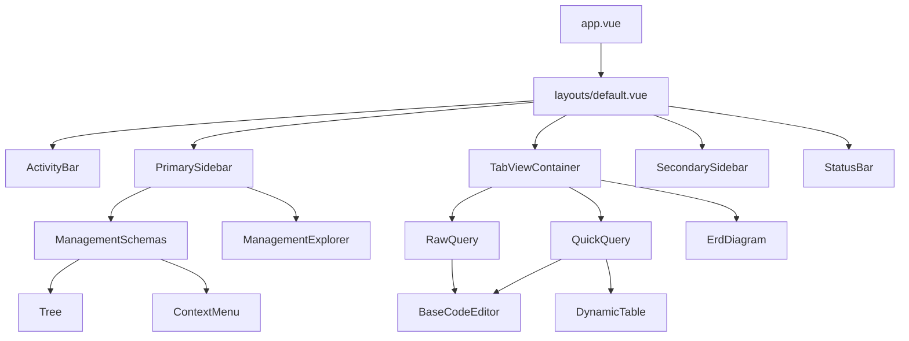

# OrcaQ Components Overview

**Version:** 1.0  
**Last Updated:** February 2026

Complete inventory of all Vue components in the OrcaQ project.

---

## Component Categories Summary

| Category              | Count | Location                 |
| --------------------- | ----- | ------------------------ |
| **Base Components**   | 7     | `/components/base/`      |
| **Business Modules**  | 13    | `/components/modules/`   |
| **UI Components**     | 33+   | `/components/ui/`        |
| **Layout Components** | 7     | `/components/` (various) |

---

## 1. Base Components

Reusable foundation components shared across the application.

| Component            | Location                   | Purpose                          |
| -------------------- | -------------------------- | -------------------------------- |
| **Tree**             | `/base/Tree/`              | Hierarchical tree view (5 files) |
| ├─ TreeFolder.vue    |                            | Folder node                      |
| ├─ TreeItem.vue      |                            | Item node                        |
| └─ TreeContainer.vue |                            | Container wrapper                |
| **BaseCodeEditor**   | `/base/code-editor/`       | CodeMirror SQL editor (20 files) |
| **DynamicTable**     | `/base/dynamic-table/`     | Generic data table (12 files)    |
| **ContextMenu**      | `/base/context-menu/`      | Right-click menu (2 files)       |
| **BaseEmpty**        | `/base/BaseEmpty.vue`      | Empty state display              |
| **LoadingOverlay**   | `/base/LoadingOverlay.vue` | Loading spinner overlay          |
| **TableSkeleton**    | `/base/TableSkeleton.vue`  | Table loading placeholder        |

---

## 2. Business Modules

Feature-specific modules containing related components, hooks, and logic.

### Quick Query Module

**Location:** `/components/modules/quick-query/` (34 files)

| Component                        | Purpose                                |
| -------------------------------- | -------------------------------------- |
| `QuickQuery.vue`                 | Main table data browser & editor       |
| `SafeModeConfirmDialog.vue`      | Confirmation before mutating data      |
| `QuickQueryErrorPopup.vue`       | Error message display                  |
| `QuickQueryControlBar.vue`       | Top toolbar (refresh, add row, delete) |
| `QuickQueryFilter.vue`           | Column filtering panel                 |
| `QuickQueryTable.vue`            | AG Grid data display                   |
| `QuickQueryTableSummary.vue`     | Row count & selection summary          |
| `QuickQueryHistoryLogsPanel.vue` | Query execution history                |
| `QuickQueryContextMenu.vue`      | Cell right-click menu                  |
| `PreviewRelationTable.vue`       | Foreign key linked data preview        |

**Hooks:**

- `useQuickQuery.ts` - Shared context & refs
- `useQuickQueryMutation.ts` - CRUD operations (save, delete)
- `useQuickQueryTableInfo.ts` - Table metadata loading

---

### Raw Query Module

**Location:** `/components/modules/raw-query/` (28 files)

| Component                  | Purpose                            |
| -------------------------- | ---------------------------------- |
| `RawQuery.vue`             | Main SQL editor interface          |
| `RawQueryLayout.vue`       | Resizable 3-panel layout           |
| `RawQueryEditorHeader.vue` | Connection selector, format button |
| `RawQueryEditorFooter.vue` | Cursor info, execute button        |
| `RawQueryResultTabs.vue`   | Multi-result tab viewer            |
| `VariableEditor.vue`       | SQL variable input                 |
| `IntroRawQuery.vue`        | Welcome/empty state                |
| `ResultTabTableView.vue`   | Table result view                  |
| `ResultTabAgentView.vue`   | AI chat result view                |
| `ResultTabErrorView.vue`   | Error display                      |

**Hooks:**

- `useRawQueryEditor.ts` - Editor state & execution
- `useRawQueryFileContent.ts` - File content management

---

### Management Schemas Module

**Location:** `/components/modules/management-schemas/` (14 files)

| Component               | Purpose                      |
| ----------------------- | ---------------------------- |
| `ManagementSchemas.vue` | Schema explorer tree         |
| `RenameDialog.vue`      | Rename table/function dialog |
| `ExportDataDialog.vue`  | Export options dialog        |

**Hooks:**

- `useSchemaContextMenu.ts` - Context menu actions
- Context menu builders (9 files for modular menu construction)

---

### ERD Diagram Module

**Location:** `/components/modules/erd-diagram/` (20 files)

| Component               | Purpose                   |
| ----------------------- | ------------------------- |
| `ErdDiagram.vue`        | Main ERD canvas           |
| `WrapperErdDiagram.vue` | Container with controls   |
| `ValueNode.vue`         | Table node representation |
| `ErdControls.vue`       | Zoom, fit, layout buttons |
| `ErdMinimap.vue`        | Diagram minimap           |

**Hooks:**

- `useErdDiagram.ts` - Diagram state & interactions
- `useErdLayout.ts` - Auto-layout algorithm

---

### Connection Management Module

**Location:** `/components/modules/management-connection/` (7 files)

| Component                   | Purpose                   |
| --------------------------- | ------------------------- |
| `ManagementConnection.vue`  | Connection list container |
| `ConnectionsList.vue`       | Connection cards grid     |
| `CreateConnectionModal.vue` | Add/edit connection form  |
| `DatabaseTypeCard.vue`      | Database type selector    |

---

### Workspace Module

**Location:** `/components/modules/workspace/` (5 files)

| Component                  | Purpose                   |
| -------------------------- | ------------------------- |
| `WorkspaceList.vue`        | Workspace selection grid  |
| `CreateWorkspaceModal.vue` | Create workspace form     |
| `WorkspaceCard.vue`        | Individual workspace card |

---

### Settings Module

**Location:** `/components/modules/settings/` (4 files)

| Component              | Purpose                   |
| ---------------------- | ------------------------- |
| `Settings.vue`         | Settings panel container  |
| `EditorConfig.vue`     | Code editor settings      |
| `AgentConfig.vue`      | AI provider configuration |
| `QuickQueryConfig.vue` | Quick Query preferences   |

---

### Other Modules

| Module                     | Location                           | Files | Purpose                   |
| -------------------------- | ---------------------------------- | ----- | ------------------------- |
| **management-users**       | `/modules/management-users/`       | 5     | User permissions & roles  |
| **management-explorer**    | `/modules/management-explorer/`    | 1     | SQL file explorer         |
| **management-export**      | `/modules/management-export/`      | 3     | Database export tools     |
| **management-erd-diagram** | `/modules/management-erd-diagram/` | 1     | ERD panel wrapper         |
| **changelog**              | `/modules/changelog/`              | 1     | Version changelog display |
| **selectors**              | `/modules/selectors/`              | 7     | Custom select components  |

---

## 3. UI Components (shadcn-vue)

Headless UI components from shadcn-vue library.

| Component     | Files | Description                  |
| ------------- | ----- | ---------------------------- |
| accordion     | 5     | Collapsible content sections |
| alert-dialog  | 10    | Modal confirmations          |
| auto-form     | 16    | Dynamic form generation      |
| avatar        | 4     | User avatars                 |
| breadcrumb    | 8     | Navigation breadcrumbs       |
| button        | 2     | Primary button variants      |
| calendar      | 13    | Date picker calendar         |
| card          | 8     | Container card               |
| checkbox      | 2     | Checkbox input               |
| collapsible   | 4     | Expandable section           |
| context-menu  | 16    | Right-click menus            |
| dialog        | 11    | Modal dialogs                |
| dropdown-menu | 15    | Dropdown menus               |
| empty         | 7     | Empty state variants         |
| form          | 8     | Form layout & validation     |
| input         | 2     | Text input                   |
| kbd           | 3     | Keyboard key display         |
| label         | 2     | Form labels                  |
| popover       | 5     | Floating content             |
| radio-group   | 3     | Radio buttons                |
| resizable     | 4     | Resizable panels             |
| scroll-area   | 3     | Custom scrollbar             |
| select        | 12    | Select dropdowns             |
| separator     | 2     | Visual dividers              |
| sheet         | 10    | Slide-out panels             |
| sidebar       | 26    | App sidebar components       |
| skeleton      | 2     | Loading skeletons            |
| sonner        | 2     | Toast notifications          |
| switch        | 2     | Toggle switch                |
| table         | 11    | Data tables                  |
| tabs          | 5     | Tab navigation               |
| textarea      | 2     | Multi-line input             |
| tooltip       | 5     | Hover tooltips               |
| Typography    | 1     | Text styling                 |

---

## 4. Layout Components

| Component                 | Location               | Purpose                 |
| ------------------------- | ---------------------- | ----------------------- |
| `ActivityBar.vue`         | `/activity-bar/`       | Horizontal navigation   |
| `ActivityBarVertical.vue` | `/activity-bar/`       | Vertical navigation     |
| `PrimarySidebar.vue`      | `/primary-side-bar/`   | Left sidebar container  |
| `SecondarySidebar.vue`    | `/secondary-side-bar/` | Right sidebar container |
| `StatusBar.vue`           | `/status-bar/`         | Bottom status bar       |
| `TabViewContainer.vue`    | `/tab-view-container/` | Tab management          |
| `TabViewHeader.vue`       | `/tab-view-container/` | Tab bar with drag-drop  |

---

## Component Dependencies



---

## Component Usage Guidelines

### Creating New Components

1. **Decide category:**

   - Reusable across features → `/base/`
   - Feature-specific → `/modules/{feature}/`
   - UI primitive → use existing shadcn-vue

2. **Follow naming:**

   - PascalCase for components
   - Create `hooks/` folder for composables
   - Create `constants/` for configuration

3. **Co-locate related files:**
   ```
   modules/my-feature/
   ├── MyFeature.vue
   ├── hooks/
   │   └── useMyFeature.ts
   ├── components/
   │   └── SubComponent.vue
   └── constants/
       └── index.ts
   ```
