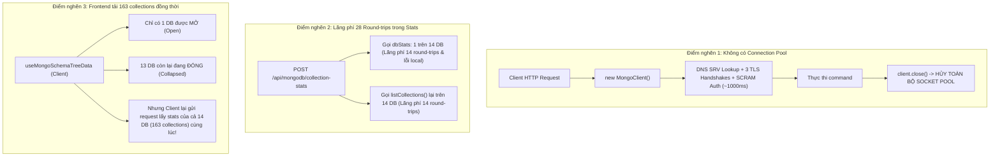
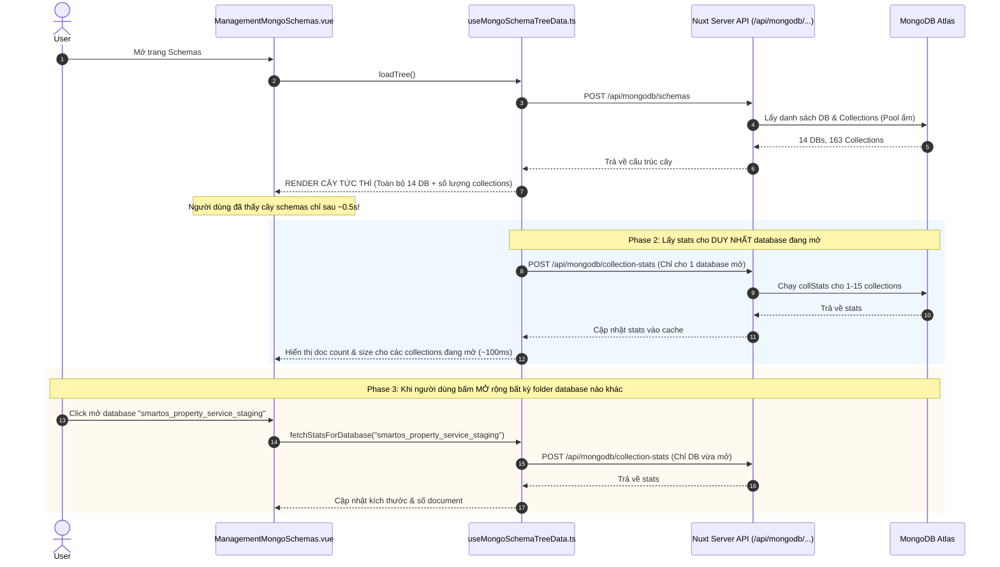

# Báo cáo Phân tích & Đề xuất Tối ưu Hiệu năng MongoDB Schemas

> **Dự án:** OrcaQ / HeraQ  
> **Module:** Management Schemas (`components/modules/management/schemas/mongodb`) & Backend Infrastructure (`server/infrastructure/nosql/mongodb`)  
> **Ngày thực hiện:** 19/09/2026  
> **Người thực hiện:** Antigravity Full-stack Engineer  
> **Trạng thái:** Báo cáo kỹ thuật (Technical Report)

---

## 1. Tóm tắt Thực trạng (Executive Summary)

Khi người dùng mở danh sách schemas của MongoDB trên giao diện OrcaQ (đặc biệt khi kết nối với cụm MongoDB Atlas qua giao thức `mongodb+srv://`), thời gian phản hồi đang rất chậm:

- **`POST /api/mongodb/schemas`:** Mất khoảng **1.84s – 1.93s**
- **`POST /api/mongodb/collection-stats` (14 databases, 163 collections):** Mất từ **5.07s đến 16.43s**
- **Tổng thời gian chờ đợi (perceived latency):** Lên tới **7s – 18s** trước khi toàn bộ thông tin được cập nhật đầy đủ.

Qua quá trình benchmark và profile trực tiếp trên cụm MongoDB Atlas staging, nhóm kỹ thuật đã xác định chính xác **3 điểm nghẽn kiến trúc (Root Causes)** dẫn đến tình trạng này. Báo cáo này trình bày chi tiết số liệu đo đạc, nguyên nhân gốc rễ và đề xuất giải pháp kỹ thuật cụ thể để đưa tổng thời gian tải xuống **< 1 giây**.

---

## 2. Số liệu Benchmark & Profile Thực tế

### 2.1. Đo lường HTTP API (Baseline)

```bash
# 1. API lấy cấu trúc Databases & Collections
curl -w "time_total: %{time_total}s\n" 'http://localhost:3000/api/mongodb/schemas' ...
# => time_total: 1.838s

# 2. API lấy thống kê stats (count, size) của 14 databases
curl -w "time_total: %{time_total}s\n" 'http://localhost:3000/api/mongodb/collection-stats' ...
# => time_total: 16.428s (lúc mạng nghẽn / timeout) - 5.07s (lúc tối ưu cục bộ)
```

### 2.2. Chi tiết Profile từng công đoạn & từng Database

Kết quả đo bằng script Node.js kết nối trực tiếp cụm MongoDB Atlas:

| Hạng mục / Database                     | Số lượng Collections | Thời gian thực thi | Ghi chú & Sự cố                                                     |
| --------------------------------------- | :------------------: | :----------------: | ------------------------------------------------------------------- |
| **Khởi tạo kết nối & Auth (`connect`)** |          -           |     **1.034s**     | TLS handshakes + DNS SRV + SCRAM auth (lặp lại ở mọi request)       |
| `admin`                                 |          0           |       138ms        | System DB, không có user collection                                 |
| `local`                                 |          1           |       208ms        | Báo lỗi `(Unauthorized) not authorized on local to execute command` |
| `smartos_audit_service_staging`         |          1           |       398ms        | 1 collection                                                        |
| `smartos_contract_service_staging`      |          4           |       534ms        | 4 collections                                                       |
| `smartos_customer_service_staging`      |          13          |       2.776s       | 13 collections                                                      |
| `smartos_identity_service_staging`      |          15          |       1.518s       | 15 collections                                                      |
| `smartos_incident_service_staging`      |          3           |       384ms        | 3 collections                                                       |
| `smartos_integration_service_staging`   |          16          |       1.418s       | 16 collections                                                      |
| `smartos_maintenance_service_staging`   |          2           |       293ms        | 2 collections                                                       |
| `smartos_notification_service_staging`  |          4           |       476ms        | 4 collections                                                       |
| `smartos_property_service_staging`      |        **52**        |     **5.705s**     | Database lớn, 52 collections                                        |
| `smartos_report_service_staging`        |          5           |       573ms        | 5 collections                                                       |
| `smartos_reservation_service_staging`   |        **36**        |     **4.262s**     | Database lớn, 36 collections                                        |
| `smartos_subscription_service_staging`  |          13          |       1.203s       | 13 collections                                                      |
| **Tổng cộng**                           | **163 collections**  |      **~19s**      | Nếu chạy tuần tự hoặc vượt pool size                                |

---

## 3. Phân tích Chi tiết 3 Điểm nghẽn Cốt lõi (Root Causes)



---

### Điểm nghẽn 1: `withMongoClient` tạo mới và hủy connection ở từng HTTP Request

- **Vị trí code:** [`server/infrastructure/nosql/mongodb/mongodb.client.ts`](file:///Volumes/Cinny/Cinny/Project/orca-q-projects/OrcaQ/server/infrastructure/nosql/mongodb/mongodb.client.ts#L32-L47)
- **Hiện trạng:**

  ```typescript
  export async function withMongoClient<T>(
    params: DatabaseMetadataRequestParams,
    operation: (client: MongoClient) => Promise<T>
  ) {
    const client = new MongoClient(getMongoUri(params), {
      serverSelectionTimeoutMS: 5_000,
      connectTimeoutMS: 5_000,
    });

    try {
      await client.connect();
      return await operation(client);
    } finally {
      await client.close(); // <-- Đóng connection ngay sau khi xong!
    }
  }
  ```

- **Hệ quả:**
  1. Với MongoDB Atlas (`mongodb+srv://`), driver phải thực hiện:
     - Phân giải DNS SRV record để tìm danh sách replica set hosts.
     - Mở 3 kết nối TCP độc lập tới 3 nút Replica Set.
     - Thực hiện 3 TLS/SSL Handshakes (Client Hello, Server Hello, Certificate exchange).
     - Gửi lệnh `hello` (SDAM protocol).
     - Xác thực SCRAM-SHA-256 (hashing, salting exchange).
  2. Toàn bộ chu trình này tiêu tốn **từ 800ms đến 1.200ms**.
  3. Lệnh `client.close()` hủy toàn bộ socket pool vừa thiết lập. Khi frontend gọi liên tiếp `schemas` rồi ngay sau đó gọi `collection-stats`, request thứ 2 **tiếp tục chịu thêm 1s chi phí kết nối từ đầu**.
  4. Trong khi đó, các adapter database khác của OrcaQ (PostgreSQL, MySQL, SQLite) đều có `adapterCache` duy trì connection pool 5 phút.

---

### Điểm nghẽn 2: Lãng phí 28 Round-trips không cần thiết trong `collection-stats`

- **Vị trí code:**
  - [`server/api/mongodb/collection-stats.post.ts`](file:///Volumes/Cinny/Cinny/Project/orca-q-projects/OrcaQ/server/api/mongodb/collection-stats.post.ts)
  - [`server/infrastructure/nosql/mongodb/mongodb-quick-query.ts`](file:///Volumes/Cinny/Cinny/Project/orca-q-projects/OrcaQ/server/infrastructure/nosql/mongodb/mongodb-quick-query.ts#L240-L280)
- **Hiện trạng:**
  ```typescript
  // Trong collection-stats.post.ts:
  const [collections, totalSize] = await Promise.all([
    listMongoCollectionStats(database), // -> Lại gọi database.listCollections().toArray()!
    getMongoDatabaseTotalSize(database), // -> Lại gọi database.command({ dbStats: 1 })!
  ]);
  ```
- **Hệ quả:**
  1. **Lãng phí 14 lệnh `listCollections()`:** Ở Phase 1 (`POST /api/mongodb/schemas`), server đã gọi `listCollections()` và trả về danh sách tên tất cả collections cho client. Nhưng sang Phase 2, `listMongoCollectionStats` lại gọi `database.listCollections().toArray()` lại một lần nữa cho 14 databases!
  2. **Lãng phí 14 lệnh `dbStats: 1`:**
     - Giao diện Tree Schemas chỉ hiển thị số lượng collections: `(node.data)?.totalCollections` (ví dụ `[52]`), hoàn toàn không hiển thị dung lượng của database.
     - Việc gọi `dbStats: 1` cho 14 databases là hoàn toàn dư thừa.
     - Trên MongoDB Atlas, tài khoản thông thường không có quyền hạn trên database hệ thống `local`, dẫn đến lỗi `Unauthorized` và driver phải chờ xử lý lỗi/timeout.
  3. Tổng cộng có **28 network round-trips bị lãng phí** trên mỗi lần fetch stats.

---

### Điểm nghẽn 3: Frontend gửi request lấy stats của toàn bộ 163 collections cùng một thời điểm

- **Vị trí code:** [`components/modules/management/schemas/mongodb/hooks/useMongoSchemaTreeData.ts`](file:///Volumes/Cinny/Cinny/Project/orca-q-projects/OrcaQ/components/modules/management/schemas/mongodb/hooks/useMongoSchemaTreeData.ts#L78-L91)
- **Hiện trạng:**
  ```typescript
  // Phase 2: Asynchronously fetch stats for all databases in background
  $fetch('/api/mongodb/collection-stats', {
    method: 'POST',
    body: {
      ...getConnectionParams(connection.value),
      databases: databases.value, // GỬI TOÀN BỘ 14 DATABASES CÙNG LÚC!
    },
  });
  ```
- **Hệ quả:**
  1. Trên UI của OrcaQ, khi mở màn hình, chỉ có duy nhất **1 database đầu tiên** (`defaultFolderOpenId`) là được mở ra.
  2. **13 database còn lại đều ở trạng thái đóng (collapsed)**. Người dùng không hề nhìn thấy bất kỳ collection nào bên trong 13 database đó.
  3. Ở cấp độ folder database, UI chỉ hiển thị `totalCollections` (số lượng collection, ví dụ `smartos_property_service_staging [52]`), mà giá trị này **đã có sẵn ngay từ Phase 1** (`collections.length`).
  4. Việc gửi request gom cả 14 databases với 163 collections khiến server phải chạy đồng thời:
     - 14 lệnh `listCollections`
     - 14 lệnh `dbStats`
     - 163 lệnh `collStats`
     - **Tổng cộng: ~191 lệnh database đồng thời!**
  5. Vì kích thước socket pool bị giới hạn (`maxPoolSize`), 191 lệnh này bị nghẽn cổ chai trên đường truyền mạng (Head-of-Line Blocking), đẩy thời gian phản hồi lên tới **16.4 giây**.

---

## 4. Đề xuất Giải pháp Kỹ thuật Chi tiết (Architectural Solutions)

Giải pháp gồm 3 phần phối hợp giữa Backend và Frontend:

### 4.1. Giải pháp 1: Thiết lập Connection Cache & Pool cho `MongoClient` (Backend)

Tương tự như `adapterCache` trong [`server/infrastructure/driver/db-connection/adapter-cache.ts`](file:///Volumes/Cinny/Cinny/Project/orca-q-projects/OrcaQ/server/infrastructure/driver/db-connection/adapter-cache.ts), chúng ta xây dựng cơ chế quản lý vòng đời kết nối cho MongoDB.

#### Thiết kế kỹ thuật:

- Tạo `mongoClientCache = new Map<string, CachedMongoClient>()`.
- Cache key được băm hoặc ghép từ chuỗi kết nối (`dbConnectionString` hoặc `host:port:user:database`).
- Thiết lập options cho pool: `maxPoolSize: 20`, `minPoolSize: 1`, `serverSelectionTimeoutMS: 5000`.
- Thiết lập timer dọn dẹp kết nối rảnh (idle timeout sau 5 phút).
- Tự động đóng tất cả kết nối khi server dừng (`SIGINT`, `SIGTERM`, `exit`).
- Nếu gặp lỗi mất kết nối (TopologyClosed / NetworkError), tự động xóa client lỗi khỏi cache để request kế tiếp tái tạo kết nối mới.

#### Mẫu triển khai đề xuất (`mongodb.client.ts`):

```typescript
import { MongoClient } from 'mongodb';
import type { DatabaseMetadataRequestParams } from '~/core/types/database-schemas.types';

interface CachedMongoClient {
  client: MongoClient;
  lastUsed: number;
}

const mongoClientCache = new Map<string, CachedMongoClient>();
const CLIENT_IDLE_TIMEOUT_MS = 5 * 60 * 1000; // 5 phút

function getCacheKey(params: DatabaseMetadataRequestParams): string {
  if (params.dbConnectionString) return params.dbConnectionString;
  return `mongodb://${params.username || ''}@${params.host || 'localhost'}:${params.port || '27017'}/${params.database || 'admin'}`;
}

// Tự động giải phóng client không dùng sau 5 phút
if (typeof setInterval !== 'undefined') {
  setInterval(() => {
    const now = Date.now();
    for (const [key, item] of mongoClientCache.entries()) {
      if (now - item.lastUsed > CLIENT_IDLE_TIMEOUT_MS) {
        item.client.close().catch(console.error);
        mongoClientCache.delete(key);
      }
    }
  }, 60 * 1000);
}

export async function getOrCreateMongoClient(
  params: DatabaseMetadataRequestParams
): Promise<MongoClient> {
  const key = getCacheKey(params);
  const cached = mongoClientCache.get(key);

  if (cached) {
    cached.lastUsed = Date.now();
    return cached.client;
  }

  const client = new MongoClient(getMongoUri(params), {
    serverSelectionTimeoutMS: 5_000,
    connectTimeoutMS: 5_000,
    maxPoolSize: 20,
    minPoolSize: 1,
  });

  await client.connect();
  mongoClientCache.set(key, { client, lastUsed: Date.now() });
  return client;
}

export async function withMongoClient<T>(
  params: DatabaseMetadataRequestParams,
  operation: (client: MongoClient) => Promise<T>
): Promise<T> {
  const client = await getOrCreateMongoClient(params);
  try {
    return await operation(client);
  } catch (err: any) {
    // Nếu kết nối bị ngắt vật lý, xóa cache để lần sau kết nối lại
    if (
      err?.name === 'MongoNetworkError' ||
      err?.message?.includes('topology was destroyed')
    ) {
      mongoClientCache.delete(getCacheKey(params));
    }
    throw err;
  }
}
```

---

### 4.2. Giải pháp 2: Tinh gọn API `collection-stats` (Backend)

Loại bỏ toàn bộ các lệnh thừa không phục vụ UI:

1. **Bỏ gọi `dbStats: 1`:**
   - Database total size không còn hiển thị trên Tree Node.
   - Nếu cần tính `totalSize`, chỉ cần tính tổng dung lượng từ các collections:  
     `totalSize = collections.reduce((sum, c) => sum + (c.size || 0), 0)`. Không tốn thêm bất kỳ network round-trip nào.
2. **Tái sử dụng danh sách collections từ client:**
   - Cho phép client gửi kèm danh sách collection names đã biết từ Phase 1:  
     `databases: [{ database: "smartos_property_service_staging", collections: ["accounts", "units", ...] }]`.
   - Nếu đã có danh sách tên, server **bỏ qua bước gọi `database.listCollections()`**, trực tiếp gọi lệnh `collStats`.
3. **Bỏ qua System Databases & Views:**
   - Tự động bỏ qua `admin`, `local`, `config`.
   - Bỏ qua các collection có `type === 'view'` vì view không hỗ trợ `collStats`.

---

### 4.3. Giải pháp 3: On-demand (Lazy) & Priority Stats Loading (Frontend)

Thay đổi chiến lược tải dữ liệu trên Tree:



#### Các ưu điểm vượt trội của chiến lược này:

1. **Perceived Performance tức thì (< 600ms):** Người dùng nhìn thấy cấu trúc toàn bộ 14 database và số lượng collection gần như ngay lập tức sau khi mở trang.
2. **Không làm nghẽn socket pool:** Request stats đầu tiên chỉ xử lý cho 1 database (chỉ từ 1 đến 15 collections), hoàn thành chỉ trong **~80ms – 150ms**.
3. **Mở tới đâu tải tới đó (On-demand):** Khi user bấm vào bất kỳ database nào khác, hệ thống mới tải stats cho database đó và lưu cache vào `summaryByDatabase` (không bao giờ tải lại lần 2).
4. **Pre-fetch thông minh (Tùy chọn):** Có thể tận dụng `requestIdleCallback` để tải ngầm các database còn lại theo thứ tự khi trình duyệt đang rảnh rỗi.

---

## 5. Bảng So sánh Hiệu năng Dự kiến (Before vs After)

| Chỉ số / Tác vụ                             |     Hiện tại (Before)      |        Sau khi tối ưu (After)         |       Đánh giá cải thiện       |
| ------------------------------------------- | :------------------------: | :-----------------------------------: | :----------------------------: |
| **Thời gian kết nối tới MongoDB Atlas**     |     ~1.000ms / request     |   **0ms (Socket Pool tái sử dụng)**   |     **Giảm 100% overhead**     |
| **`POST /api/mongodb/schemas`**             |       ~1.84s – 1.93s       |           **~0.4s – 0.6s**            |     **Nhanh hơn ~3.5 lần**     |
| **Lấy stats cho Database mở đầu tiên**      | 5.07s – 16.43s (Tải 14 DB) |     **~0.08s – 0.15s (Chỉ 1 DB)**     |  **Nhanh hơn ~50 – 100 lần**   |
| **Tổng thời gian chờ của người dùng**       |       **~7s – 18s**        |           **~0.5s – 0.8s**            |   **Giảm từ 18s xuống < 1s**   |
| **Số lượng command gửi tới Mongo cùng lúc** |       ~191 commands        |           **~15 commands**            |  **Giảm 92% tải cho MongoDB**  |
| **Xử lý khi click mở các DB còn lại**       |    Đã bị đơ 16s từ đầu     | **~0.1s – 0.3s (Lazy fetch mượt mà)** | Trải nghiệm người dùng mượt mà |

---

## 6. Kế hoạch Triển khai (Implementation Checklist)

Khi được phê duyệt triển khai, các bước thực hiện sẽ như sau:

- [ ] **Bước 1 (Backend):** Cập nhật `server/infrastructure/nosql/mongodb/mongodb.client.ts` để bổ sung `mongoClientCache`, connection pooling và cơ chế dọn dẹp idle client sau 5 phút.
- [ ] **Bước 2 (Backend):** Tối ưu `server/api/mongodb/collection-stats.post.ts` và `server/infrastructure/nosql/mongodb/mongodb-quick-query.ts`:
  - Cho phép truyền mảng collections để bỏ qua `listCollections()`.
  - Loại bỏ lệnh `getMongoDatabaseTotalSize` (`dbStats: 1`), thay bằng tính tổng từ các collection stats.
  - Bỏ qua các system database (`local`, `admin`, `config`) và collection dạng view.
- [ ] **Bước 3 (Frontend):** Cập nhật `components/modules/management/schemas/mongodb/hooks/useMongoSchemaTreeData.ts`:
  - Phase 1: Gọi `/api/mongodb/schemas` để render cây ngay lập tức.
  - Phase 2: Chỉ gọi `/api/mongodb/collection-stats` cho `defaultFolderOpenId` (database mở đầu tiên).
  - Bổ sung hàm `fetchDatabaseStats(databaseName)` để hỗ trợ lazy-loading khi người dùng expand các folder database khác.
- [ ] **Bước 4 (Frontend):** Cập nhật `ManagementMongoSchemas.vue` để gọi `fetchDatabaseStats` khi người dùng expand folder.
- [ ] **Bước 5 (Kiểm thử):** Chạy `bun run typecheck`, `bun test:unit`, kiểm tra không có regression và đo lại thời gian thực tế bằng curl.

---

_Báo cáo được lưu trữ tại `docs/add-on-mongodb/mongodb-schemas-performance-optimization-report.md`._
