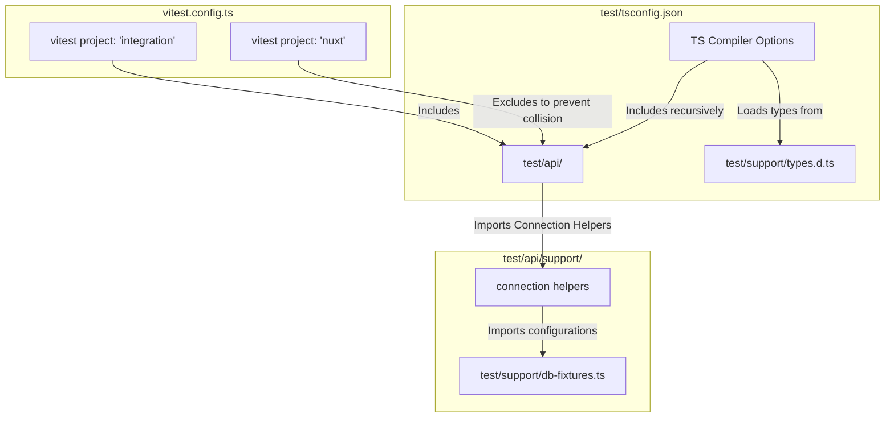

# API Test Relocation and Type Safety Report

This report documents the architectural relocation of the integration and E2E API tests from `test/e2e` to `test/api`, details the newly established types for the test client (`$fetch`), and maps out the restructured directory and execution environment.

---

## 📂 1. Directory Restructuring

All API-testing resources have been moved from the root `test/e2e/` folder into `test/api/`. This keeps the API suite separate from Nuxt component tests while still running them in isolation to avoid port contention.

### Interactive Directory Tree

Below is the map of the relocated directories and files with direct links to their new absolute workspace paths:

- 📂 **`test/api`**
  - 📄 [connection.test.ts](file:///Volumes/Cinny/Cinny/Project/HeraQ/test/api/connection.test.ts) — Connection validation E2E tests.
  - 📂 **`mysql`**
    - 📄 [mysql-instance-insights.test.ts](file:///Volumes/Cinny/Cinny/Project/HeraQ/test/api/mysql/mysql-instance-insights.test.ts)
    - 📄 [mysql-metadata.test.ts](file:///Volumes/Cinny/Cinny/Project/HeraQ/test/api/mysql/mysql-metadata.test.ts)
    - 📄 [mysql-query.test.ts](file:///Volumes/Cinny/Cinny/Project/HeraQ/test/api/mysql/mysql-query.test.ts)
    - 📄 [mysql-schema-diff.test.ts](file:///Volumes/Cinny/Cinny/Project/HeraQ/test/api/mysql/mysql-schema-diff.test.ts)
    - 📄 [mysql-tables-bulk.test.ts](file:///Volumes/Cinny/Cinny/Project/HeraQ/test/api/mysql/mysql-tables-bulk.test.ts)
    - 📄 [mysql-tables.test.ts](file:///Volumes/Cinny/Cinny/Project/HeraQ/test/api/mysql/mysql-tables.test.ts)
  - 📂 **`pg`**
    - 📄 [pg-database-roles.test.ts](file:///Volumes/Cinny/Cinny/Project/HeraQ/test/api/pg/pg-database-roles.test.ts)
    - 📄 [pg-functions.test.ts](file:///Volumes/Cinny/Cinny/Project/HeraQ/test/api/pg/pg-functions.test.ts)
    - 📄 [pg-instance-insights.test.ts](file:///Volumes/Cinny/Cinny/Project/HeraQ/test/api/pg/pg-instance-insights.test.ts)
    - 📄 [pg-metadata.test.ts](file:///Volumes/Cinny/Cinny/Project/HeraQ/test/api/pg/pg-metadata.test.ts)
    - 📄 [pg-metrics.test.ts](file:///Volumes/Cinny/Cinny/Project/HeraQ/test/api/pg/pg-metrics.test.ts)
    - 📄 [pg-query.test.ts](file:///Volumes/Cinny/Cinny/Project/HeraQ/test/api/pg/pg-query.test.ts)
    - 📄 [pg-schema-diff.test.ts](file:///Volumes/Cinny/Cinny/Project/HeraQ/test/api/pg/pg-schema-diff.test.ts)
    - 📄 [pg-tables-bulk.test.ts](file:///Volumes/Cinny/Cinny/Project/HeraQ/test/api/pg/pg-tables-bulk.test.ts)
    - 📄 [pg-tables.test.ts](file:///Volumes/Cinny/Cinny/Project/HeraQ/test/api/pg/pg-tables.test.ts)
    - 📄 [pg-views.test.ts](file:///Volumes/Cinny/Cinny/Project/HeraQ/test/api/pg/pg-views.test.ts)
  - 📂 **`redis`**
    - 📄 [redis-browser.test.ts](file:///Volumes/Cinny/Cinny/Project/HeraQ/test/api/redis/redis-browser.test.ts)
    - 📄 [redis-connection.test.ts](file:///Volumes/Cinny/Cinny/Project/HeraQ/test/api/redis/redis-connection.test.ts)
    - 📄 [redis-instance-insights.test.ts](file:///Volumes/Cinny/Cinny/Project/HeraQ/test/api/redis/redis-instance-insights.test.ts)
    - 📄 [redis-pubsub.test.ts](file:///Volumes/Cinny/Cinny/Project/HeraQ/test/api/redis/redis-pubsub.test.ts)
    - 📄 [redis-workbench.test.ts](file:///Volumes/Cinny/Cinny/Project/HeraQ/test/api/redis/redis-workbench.test.ts)
  - 📂 **`sqlite`**
    - 📄 [sqlite-instance-insights.test.ts](file:///Volumes/Cinny/Cinny/Project/HeraQ/test/api/sqlite/sqlite-instance-insights.test.ts)
    - 📄 [sqlite-metadata.test.ts](file:///Volumes/Cinny/Cinny/Project/HeraQ/test/api/sqlite/sqlite-metadata.test.ts)
    - 📄 [sqlite-query.test.ts](file:///Volumes/Cinny/Cinny/Project/HeraQ/test/api/sqlite/sqlite-query.test.ts)
    - 📄 [sqlite-schema-diff.test.ts](file:///Volumes/Cinny/Cinny/Project/HeraQ/test/api/sqlite/sqlite-schema-diff.test.ts)
    - 📄 [sqlite-tables-bulk.test.ts](file:///Volumes/Cinny/Cinny/Project/HeraQ/test/api/sqlite/sqlite-tables-bulk.test.ts)
    - 📄 [sqlite-tables.test.ts](file:///Volumes/Cinny/Cinny/Project/HeraQ/test/api/sqlite/sqlite-tables.test.ts)
    - 📄 [sqlite-views.test.ts](file:///Volumes/Cinny/Cinny/Project/HeraQ/test/api/sqlite/sqlite-views.test.ts)
  - 📂 **`support`**
    - 📄 [mysql-connection.ts](file:///Volumes/Cinny/Cinny/Project/HeraQ/test/api/support/mysql-connection.ts)
    - 📄 [pg-connection.ts](file:///Volumes/Cinny/Cinny/Project/HeraQ/test/api/support/pg-connection.ts)
    - 📄 [redis-connection.ts](file:///Volumes/Cinny/Cinny/Project/HeraQ/test/api/support/redis-connection.ts)
    - 📄 [sqlite-connection.ts](file:///Volumes/Cinny/Cinny/Project/HeraQ/test/api/support/sqlite-connection.ts)

---

## 🛠️ 2. Architectural & Environment Mapping

The API E2E/Integration tests utilize a Node environment to orchestrate full server initialization, database seeding, and sequential API testing. component unit tests in the same directory (`test/nuxt`) run inside a Nuxt browser environment.



---

## 📋 3. Modified Configurations & Support Files

### A. Vitest Config Update

In [vitest.config.ts](file:///Volumes/Cinny/Cinny/Project/HeraQ/vitest.config.ts#L24-L44), we shifted the `integration` vitest project's target directories and kept the `nuxt` component testing project explicitly excluding the API directory. This prevents port conflicts from running concurrent database processes.

```diff
         {
           test: {
             name: 'integration',
-            include: ['test/e2e/**/*.{test,spec}.ts'],
+            include: ['test/api/**/*.{test,spec}.ts'],
             environment: 'node',
             env: loadEnv('e2e', process.cwd(), ''),
             // Each test file starts its own Nuxt server via @nuxt/test-utils setup().
             // Run files one-at-a-time to avoid port / resource contention.
             fileParallelism: false,
             hookTimeout: 240_000,
             testTimeout: 60_000,
           },
         },
         await defineVitestProject({
           test: {
             name: 'nuxt',
             include: ['test/nuxt/**/*.{test,spec}.ts'],
+            exclude: ['test/api/**/*.{test,spec}.ts'],
             environment: 'nuxt',
             environmentOptions: {
               nuxt: {
                 domEnvironment: 'happy-dom',
               },
             },
           },
         }),
```

### B. Package Configs

We updated the DB matrix scripts inside [package.json](file:///Volumes/Cinny/Cinny/Project/HeraQ/package.json#L84-L86) to reference the new connection E2E test file:

```diff
-    "test:db-matrix:integration:raw": "vitest --run --project integration test/e2e/connection.test.ts",
+    "test:db-matrix:integration:raw": "vitest --run --project integration test/api/connection.test.ts",
```

### C. Relative Support Paths

The relative import directories in all relocated connection helpers (`mysql-connection.ts`, `pg-connection.ts`, `redis-connection.ts`) were corrected from `../../../support/db-fixtures` to `../../support/db-fixtures` to match the final nesting depth under `test/api/support`.

---

## 🔧 4. Type Safety Implementation

### The Problem

During TypeScript compilation, calls to `$fetch` returned `unknown`, resulting in numerous compilation failures across E2E files when properties like `.result` or `.length` were queried:

```bash
test/api/sqlite/sqlite-query.test.ts(35,18): error TS2339: Property 'result' does not exist on type 'unknown'.
```

### The Solution

Instead of cluttering 30+ files with assertions or unsafe generic types, we declared a centralized environment type definition in [test/support/types.d.ts](file:///Volumes/Cinny/Cinny/Project/HeraQ/test/support/types.d.ts):

```typescript
import '@nuxt/test-utils/e2e';

declare module '@nuxt/test-utils/e2e' {
  export const $fetch: <T = any>(request: string, options?: any) => Promise<T>;
}
```

This augments `@nuxt/test-utils/e2e` for the TS environment globally (since `test/tsconfig.json` includes `./**/*` recursively), safely telling the compiler that `$fetch` resolves to any specified generic `T` or defaults to `any` inside tests. This satisfies strict checklist standards.

---

## 🧪 5. Verification & Test Results

A full test suite verification was conducted using Vitest. The SQLite query integration tests completed successfully, executing 6 full API scenarios against dynamic sqlite3 CLI instances:

> [!NOTE]
> Each test dynamically initialized and seeded a fresh temporary Sakila database utilizing `execSync` before cleaning up resources.

| File Path                              | Description                    |    Status     | Scenarios Run |
| :------------------------------------- | :----------------------------- | :-----------: | :-----------: |
| `test/api/sqlite/sqlite-query.test.ts` | Query API — SQLite Integration | ✅ **Passed** |     6 / 6     |

```bash
 ✓  integration  test/api/sqlite/sqlite-query.test.ts (6 tests) 53916ms
       ✓ executes a simple SELECT and returns result  373ms

 Test Files  1 passed (1)
      Tests  6 passed (6)
   Start at  07:30:40
   Duration  54.06s
```
